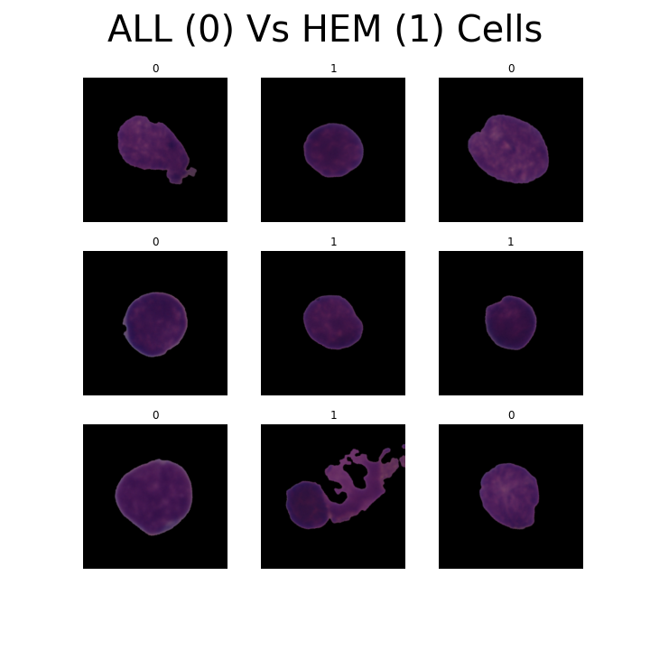
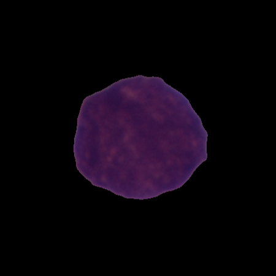
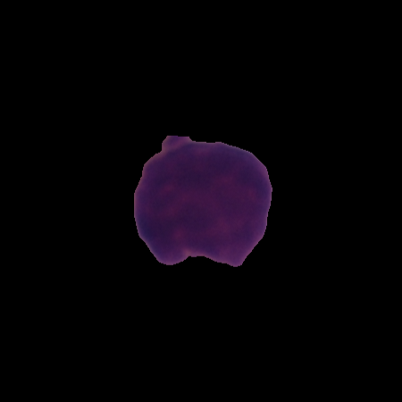
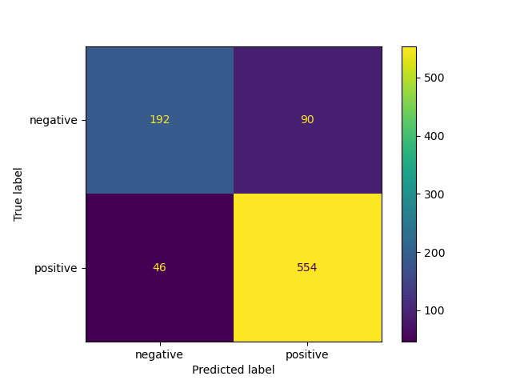

# Project 4 - Leukemia Classification with Tensorflow
---

## Table of Contents

- [Problem Statement](#Problem-Statement)
- [Executive Summary](#Executive-Summary)
- [Background](#Background)
- [Dataset](#Dataset-Links)
- [Data Dictionary](#Data-Dictionary)
- [Analytical Summary](#Analytical-Summary)
-[Analysis and Findings](#Analysis-and-Finsdings)
- [CNN Model](#CNN-Model)
- [Covoluted Neural Network Model for Predicting ALL (Notebook)](notebooks/cnn_model_to_predict_all.ipynb)
- [KNN Model](#KNN-Model)
- [KNN Model for Predicting ALL (Notebook)](notebooks/classification_model.ipynb)
- [Pixelating Image Data Into a DF for Classic Classification Models(Notebook)](notebooks/pixelating_image_data.ipynb)
- [Conclusions and Recommendations](#Conclusion-and-Recommendations)
- [Works Cited](#Works-Cited)

---

## Problem Statement

Acute lymphoblastic leukemia, ALL, is the most common type of childhood cancer and accounts for almost 25% of all pediatric cancers in the United States ([*source*](https://www.chop.edu/conditions-diseases/acute-lymphoblastic-leukemia-all)). Here we introduce a  binary classification model to identify morphological characteristics of white blood cells to determine if they have normal morphology or morphology that is consistent with a leukemia blast (a cancerous white blood cell associated with ALL in the dataset).  This model will help to reduce costs and time in diagnosing possible cases of ALL.

Conventional diagnostics include a blood test that counts the number of white and red blood cells in a sample. Elevated white blood cell counts can suggest the possibility of ALL. Currently, if a sample indicates elevated white blood cell counts it is then subjected to flow cytometry and then the possibility of patient biopsy of bone marrow or lymph node tissue. Introducing a technique such as Quantitative Cell Imaging paired with computational modeling in tandem with blood tests that exhibit elevated white blood cell counts could reduce the costs and time for diagnosis improving the chances of successful treatment([*source*](https://www.ncbi.nlm.nih.gov/pmc/articles/PMC3565969/)).

The ideal outcome would be to have an accuracy score of above 80%. We would also like to minimize Type II errors as much as possible to ensure that samples that contain cells with ALL morphology are not missed by our model. A Convoluted Neural Network model will be used to predict ALL on raw image data and KNN Classifier will be used to predict ALL on pixelated image data. Creating a model that can accurately identify ALL will allow for more high throughput screening methods for diagnostics and reduce costs as well as staff hours and improve the chances of timely treatment for ALL patients.

---

## Executive Summary

Acute Lymphocytic Leukemia (ALL) is the most common for of pediatric cancer and accounts for over 25% of cancer in children. Treatment for ALL is generally successful in curing children, however, early detection is crucial in effective treatment.

Here we have developed two models for early detection that can be used in tandem with routine blood testing to assess the morphology of white blood cells to determine if cancerous cells are present. The model negates the necessity of costly and time consuming genetic screens and can be performed as a profilactic measure even if ALL is not suspected. 

Implementing our models into routine health screenings would reduce the costs and necessary manual processes performed by health care staff as well as exponentially improve the rate of early detection of ALL improving the survival rate of children afflicted with ALL. 

We here at Reddy, Smugerski and Askinosie want to help you save lives! Join us in the fight against cancer for children today!!!

---

## Background

Cancer remains one of the leading causes of death worldwide. In 2022 1.9 million new cancer cases were reported in the US and 610,000 deaths due to cancer or cancer related maladies([*source*](https://www.cancer.org/latest-news/facts-and-figures-2022.html#:~:text=A%20total%20of%201.9%20million,about%201%2C670%20deaths%20a%20day.)). Acute lymphocytic leukemia (ALL) is the leading reported cancer in children accounting for over 25% of all pediatric cancers([*source*](https://www.chop.edu/conditions-diseases/acute-lymphoblastic-leukemia-all)). Treating ALL, like all cancer, is profoundly impacted by early identification of biological cues and early intervention. ALL, especially, has a high incidence of recovery when caught early in children([*source*](https://www.ncbi.nlm.nih.gov/pmc/articles/PMC3565969/)).

All is cancer of blood or bone marrow that progresses rapidly producing immature lymphocytes (white blood cells). The immature lymphocytes are not able to function the way that a normal lymphocyte do and, due to the prolific nature of cancer, build up in numbers that begin to "crowd out" the functional white blood cells that eventually leads to disease and ultimately death([*source*](https://www.cancer.org/cancer/acute-lymphocytic-leukemia/about/what-is-all.html)). Fortunately, ALL treatment has a high success rate if caught early([*source*](https://www.cancer.gov/types/leukemia/patient/adult-all-treatment-pdq)). Therefore, advanced screening techniques are being developed to identify ALL in the early stages of the cancer to improve the success rate of treatments. 

Here we describe to models, one Convoluted Neural Network and one K Nearest Neighbors, to analyze image data and report ALL positive cells from large image libraries within seconds. Implementing machine learning models in  blood tests taken during routine health screenings would ensure individuals with ALL cells present in their bodies receive early treatment, even if they are asymptomatic for the disease.

---
## Dataset Links

* [*Original Kaggle Data Set*](https://www.kaggle.com/datasets/andrewmvd/leukemia-classification)
* [*Model Data Set Adapted from Kaggle Data Set*](https://drive.google.com/drive/folders/1gtA0dEJB7oINfVGCEr6kTt7BR8UNloBC?usp=sharing)

---
## Data Dictionary

|Feature|Type|Dataset|Description|
|---|---|---|---|
|**Pixel1-784**|Float|fold_0_all_hem_pixelated|Pixel Values.|
|**Label**|object|fold_0_all_hem_pixelated|Identification of positive or negative for ALL|

---

## Analytical Summary

The objective of this project was to construct a model that can distinguish between a normal cell and a cancerous lymphoblast cell using image data taken from whole blood. This will reduce the costs and time necessary for accurate diagnosis of ALL and improve the chances of early, effective treatment of ALL as well as the chances of patient survival. The CNN model proves to be almost 90% accurate in identifying ALL cells while the KNN model is slightly less effective at 85% accuracy. 

---
## Analysis and Findings

### CNN Model 

Distinguishing between a healthy and cancerous cell can be difficult, even for a trained professional. The morphology of a cell can vary greatly making it difficult to determine the health of a cell. Below is an example of 9 cells that are labeled as either 0 for cancerous or 1 for healthy. 

*Figure 1. Images of cancerous ALL cells, marked as class 0, and healthy HEM cells, marked as class 1*
 
 
The images indicate that cancerous cells and healthy cells share common morphology. In fact, several of the healthy cells contain amorphous morphology that could be considered as consistent with cancerous cells. Our model on the raw image data reflects this as it is slightly overfit suggesting it has built up a high degree of variance in fitting with the training model.
 
 
    
|Evaluation Group|Score | 
| --- | --- | 
| Train Loss    | 0.26| 
| Validation Loss   | 0.54 | 
--
| Train Accuracy    | 89%| 
| Validation Accuracy   | 80% |

*Table 1. Train and Validation Loss and Accuracy for Raw Image Data Model*

    
 
 
In order to reduce the variance in the CNN model and improve the models ability to train on the training set we applied image augmentation. Augmentation randomly rotates the images in the training set introducing more bias into the model and accounts for images that may have slightly different orientation in  validation set. 
  
 

 

 *Figure 2. Leukocyte with Augmentation Applied*

  
 
The augmentation is almost negligible to the human eye but both improved the accuracy of the model and reduced the loss.
  
 

|No Augmentation||Augmentation||
|---|---|---|---|
|Train Loss|0.26|Train Loss|0.30|
|Validation Loss|0.54|Validation Loss|0.28|
--
|Train Accuracy|0.89|Train Accuracy|0.88|
|Validation Accuracy|0.80|Validation Accuracy|0.89|

*Table 2. Train and Validation Loss and Accuracy for Raw Image Data Model Vs Augmented Image Model*

    
  
 
    
The model was then used to predict test images from a separate data set to analyze its ability and confidence in distinguishing between ALL and HEM cells. 
    
### ALL (Cancerous) Cell
    
 

*Figure 3. Image of a cancerous ALL cell*
      
 

The model correctly identified this cell as a cancerous ALL cell with over 95% confidence
  
 
    
### HEM (Normal) Cell

 

*Figure 4. Image of a healthy HEM cell*
      
 

The model correctly identified this cell as a healthy HEM cell with over 99% confidence.

 
 
    
The notebook for the CNN section can be found here: [Covoluted Neural Network Model for Predicting ALL](notebooks/cnn_model_to_predict_all.ipynb).

### KNN Model

When it came to our regression modeling, kNN performed best for us with a training score of 0.86 and a testing score of 0.85. We consider these scores to be satisfactory because it means we have minimized overfitting with our model and gives us confidence that integration of future cell images will be read and predicted with minimal error.

|Scoring Group|KNN Score|
|---|---|
|Training Score|0.86|
|Testing Score|0.85|

*Table 3.Stacked Model Train and Test Score|KNN Model*
 
 

In line with the training and testing scores above the model, there were Type 1 and Type 2 errors. These are summarized in the confusion matrix below.

 

*Figure 5. Confusion Matrix for kNN Model*

 
 
The accuracy, specificity, sensitivity, precision and the harmonic mean of precision and recall (F1-score) were calculated for the KNN model. Those resilts are summarized in the table below.
  
 
 
    
|Evaluation Statistic|Score|
|---|---|
|Accuracy|0.85|
|Specificity|0.68|
|Sensitivity|0.92|
|Precision|0.86|
|F1 Score|0.89|
    

*Table 4.Model Analysis Values*
 
 
    
The notebook for the KNN section can be found here: [KNN Model for Predicting ALL](notebooks/classification_model.ipynb)

The notebook for converting raw image data into pixel values for the KNN modeling can be found here: [Pixelating Image Data Into a DF for Classic Classification Models](notebooks/pixelating_image_data.ipynb)

## Conclusions and Recommendations

The goal of this project was to create a model with over 80% accuracy in predicting ALL cells. Both the CNN model and the KNN model exceed our goal and are able to predict ALL cells beyond what is capable by the human eye. 

Our recommendation is that this CNN model be integrated into routine blood screenings during health checkups to ensure early detection of ALL improving the chances of successful treatment. 
    
For future work fine tuning te model woudl aid in increasing the accuarcy of ALL detection as well as reducing the number of Type II errors where an ALL cell is mistakenly identified as a non cancerous HEM cell.

---

## Works Cited

"Image Classification from Scratch." Keras, https://keras.io/examples/vision/image_classification_from_scratch/ Accessed 5 February 2023

"Risk of Dying from Cancer Continues to Drop at an Accelerated Pace." American Cancer Society, https://www.cancer.org/latest-news/facts-and-figures-2022.html#:~:text=A%20total%20of%201.9%20million,about%201%2C670%20deaths%20a%20day Accessed 5 February 2023

"Real Time Blood Testing Using Quantitative Phase Imaging." National Library of Medicine, https://www.ncbi.nlm.nih.gov/pmc/articles/PMC3565969/ Accessed 5 February 2023

"Acute Lymphoblastic Leukemia (ALL)." Childrens' Hospital of Philadelphia, https://www.chop.edu/conditions-diseases/acute-lymphoblastic-leukemia-all Accessed 5 February 2023

"What Is Acute Lymphocytic Leukemia (ALL)?" American Cancer Society, https://www.cancer.org/cancer/acute-lymphocytic-leukemia/about/what-is-all.html Accessed 5 February 2023

"Adult Acute Lymphoblastic Leukemia Treatment (PDQ®)–Patient Version." National Cancer Institute, https://www.cancer.gov/types/leukemia/patient/adult-all-treatment-pdq Accessed 5 February 2023